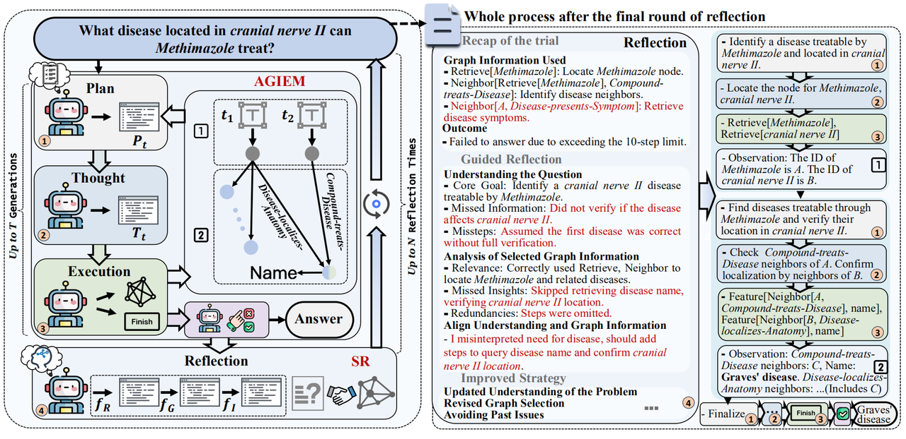

<!-- 
<div align="center">
   
## Graph Counselor: Adaptive Graph Exploration via Multi-Agent Synergy 
🏆 **ACL 2025 Main Conference Paper**  

[](https://arxiv.org/pdf/2506.03939)

_Junqi Gao <sup>1,2</sup>, Xiang Zou <sup>2</sup>, Ying Ai <sup>3</sup>, Dong Li <sup>1,2,†</sup>, Yichen Niu <sup>3</sup>, Biqing Qi <sup>1,†</sup>, Jianxing Liu <sup>3</sup>_

<sup>1</sup> _Shanghai Artificial Intelligence Laboratory_

<sup>2</sup> _School of Mathematics, Harbin Institute of Technology_

<sup>3</sup> _Department of Control Science and Engineering, Harbin Institute of Technology_

_<sup>†</sup> Corresponding Authors_



</div>

### ✨ Key Features

🧠 Multi-Agent Synergy: Planning, Thought, and Execution agents for optimized reasoning

🌐 Adaptive Graph Exploration: Dynamic retrieval strategies for complex knowledge graphs

🔍 Self-Reflection: Multi-perspective analysis for improved accuracy


### ⚙️ Installation
```bash
conda create -n graphcounselor python=3.8.1
conda activate graphcounselor
conda install pytorch1.12.1 torchvision0.13.1 torchaudio==0.12.1 cudatoolkit=11.3 -c pytorch
conda install -c pytorch -c nvidia faiss-gpu=1.7.4
conda install -c conda-forge langchain0.1.0 langchain-core0.1.7 langchain-community==0.0.9
conda install -c conda-forge openai1.6.1 scikit-learn1.3.2 sentence-transformers==2.2.2
conda install -c conda-forge transformers4.36.2 datasets2.16.1
conda install jsonlines tiktoken networkx IPython
pip install evaluate absl-py rouge_score
```
### 🚀 Quick Start

1. Download graph data [here](https://drive.google.com/drive/folders/1DJIgRZ3G-TOf7h0-Xub5_sE4slBUEqy9?usp=share_link) and save to data/processed_data/{data_name}

2. Run Graph Counselor:
   ```bash scripts/run_Graph-Counselor.sh```
3. Evaluation:
   ```bash eval.sh```


### 📚 Citation
```
@article{gao2025graphcounselor,
  title={Graph Counselor: Adaptive Graph Exploration via Multi-Agent Synergy},
  author={Junqi Gao and Xiang Zou and Ying Ai and Dong Li and Yichen Niu and Biqing Qi and Jianxing Liu},
  journal={arXiv preprint arXiv:2506.03939},
  year={2025},
  url={https://arxiv.org/abs/2506.03939}
}
```
 -->

## **Graph Counselor: Unified Reasoning & Dynamic Retrieval**

**An Optimized Fork for Efficient Graph Exploration**


### **📖 Introduction**

This project is an advanced optimization based on **Graph Counselor**. It refactors the original complex multi-agent framework into a streamlined **Unified Reasoning** architecture. By leveraging strong open-source models (e.g., Qwen2.5) and **Dynamic Few-Shot Retrieval**, this version significantly reduces inference latency, improves context coherence, and enhances the model's adaptability to diverse graph queries.

### **✨ Key Features**

* **⚡ Unified Reasoning Architecture**:  
  * **One-Pass Inference**: Merged the *Planning Agent* and *Thought Agent* into a single, cohesive reasoning step. The model generates the Plan, Thought, and Action in one go, reducing API calls and network overhead by over **60%**.  
  * **Enhanced Coherence**: Solves the "context loss" issue found in multi-step agents by allowing the model to maintain a continuous Chain-of-Thought (CoT).  
* **🔍 Dynamic Few-Shot Retrieval**:  
  * **Semantic Matching**: Replaced static, hard-coded examples with a **Dynamic Retriever** (powered by sentence-transformers/all-mpnet-base-v2 and FAISS).  
  * **Context-Aware**: Automatically retrieves the top-K most relevant reasoning paths from the few\_shot\_bank for each specific query, helping the model generalize better to unseen questions.  
* **🚀 High-Performance Local Inference**:  
  * Fully integrated with **vLLM** for high-throughput local deployment.  
  * Optimized for modern GPUs (e.g., RTX 4090/A100) with robust timeout handling and stop-token logic to prevent server freezes.

### **⚙️ Installation**

The environment is managed via Conda. We provide a comprehensive environment.yml for one-click setup.

1. **Clone the repository**  
```
   git clone \[https://github.com/EEAlstonstar/GraphRAG\_biomedical.git\](https://github.com/EEAlstonstar/GraphRAG\_biomedical.git)  
   cd GraphRAG\_biomedical
```
2. **Create and Activate Environment**  
```
   \# Create environment from config file  
   conda env create \-f environment.yml

   \# Activate the environment  
   conda activate graphcounselor
```
3. **Model Preparation**  
   * This project uses **Qwen2.5-7B-Instruct** by default.  
   * Ensure the model weights are downloaded to models/ or update the MODEL\_PATH in scripts/run\_Graph-Counselor.sh.

### **🚀 Quick Start**

#### **1\. Download Data**

Download the processed graph data from the link below.

[📂 Download Graph Data (Google Drive)](https://drive.google.com/drive/folders/1DJIgRZ3G-TOf7h0-Xub5_sE4slBUEqy9?usp=share_link)

Extract the data and place it in the data/processed\_data/ directory. The structure should look like this:
```
data/processed\_data/  
└── biomedical/  
    ├── graph.json  
    ├── data.json  
    └── ...
```
#### **2\. Run the Agent**

We provide an all-in-one script that starts the vLLM server and runs the agent loop.

\# Run from the root directory  
bash scripts/run\_Graph-Counselor.sh

**Note:** The script will automatically clean the input prompts (removing redundant graph definitions) and initialize the dynamic retriever.

#### **3\. View Results**

* **Logs:** Check real-time logs in scripts/\*.log.  
* **Output:** Results are saved to results/Qwen2.5-7B-Instruct/.

### **📂 Project Structure**
```
.  
├── code/  
│   ├── GraphAgent\_Plan\_Reflect\_vllm.py  \# Core Unified Agent Logic  
│   ├── run.py                           \# Main entry point  
│   ├── tools/                           \# Dynamic Retriever & Graph Tools  
│   └── ...  
├── data/                                \# Dataset directory  
├── models/                              \# Local LLM weights (ignored by git)  
├── scripts/  
│   └── run\_Graph-Counselor.sh           \# Auto-start script  
└── environment.yml                      \# Dependency definitions
```
### **🏷️ Acknowledgements**

This project is built upon the original work of **Graph Counselor**. We acknowledge the original authors for their pioneering contributions to Multi-Agent Graph Exploration.